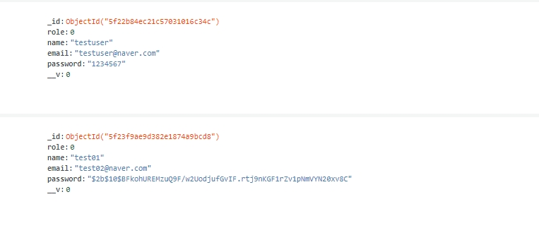

# 10장

#### 용어
- bcrypt
    - Blowfish를 기반으로 만들어진 단방향 암호화 해싱함수 
    - rainbow table 공격을 막기 위해 salt 사용 
    - 현재 데이터베이스에 사용자의 비밀번호가 plain text로 저장되어 보안적으로 취약하기 때문에 이를 개선하기 위해 사용

```sh
$ npm install bcrypt --save
```
- bcrypt 설치 

#### 내용

```sh
// mongoose 메소드 
// 지정한 메소드를 실행하기 전에 코드를 실행
userSchema.pre('save', function( next ) {
    // mongoDB save 메소드 실행 이전에 비밀번호를 암호화 

    // index.js의 const user = new User(req.body);로 인해 model에 정보를 입력한 상태
    var user = this; 

    // 비밀번호가 변경될때에만 동작
    // 비밀번호를 입력하거나 변경할 때에만 암호화가 되어야 하며, 그 외의 경우에는 동작할 필요가 없음 
    if(user.isModified('password')) {
        // bcrypt 공식문서 참조 
        // bcrypt.genSalt : salt 생성 
        bcrypt.genSalt(saltRounds, function(err, salt) {
            // salt 생성 도중 오류 발생 시 오류내용을 가지고 save 메소드 호출 이후의 코드를 실행하도록 지시
            if(err) {
                return next(err);
            }

            // salt 생성 완료 시 
            // myPlaintextPassword : 첫 번째 인자, 사용자가 입력한 암호화되기 이전의 비밀번호 
            // salt : 두 번째 인자, 암호화를 위한 문자열 
            // hash : callback function 두 번째 인자, 암호화된 비밀번호 
            bcrypt.hash(user.password, salt, function(err, hash) {
                if(err) {
                    return next(err);
                }
                // 암호화된 비밀번호로 변경 
                user.password = hash;

                // save 메소드 호출 이후의 코드를 실행하도록 지시 
                next();
            });
        });
    }
    // 비밀번호가 아닌 다른 요소를 변경하는 경우 
    else {
        next();
    }

    // 해당 구간에 next()가 있을 경우 비밀번호를 암호화 하기 전에 next() 구문으로 바로 save 메소드를 실행하기 때문에 암호화가 제대로 되지 않음 
    // next();

})
```
- bcrypt를 사용하여 암호화를 진행하는 코드 


- testuser : password가 plain text로 그대로 노출되어있음
- test01 : password가 bcrypt로 인해 암호화되었음 
