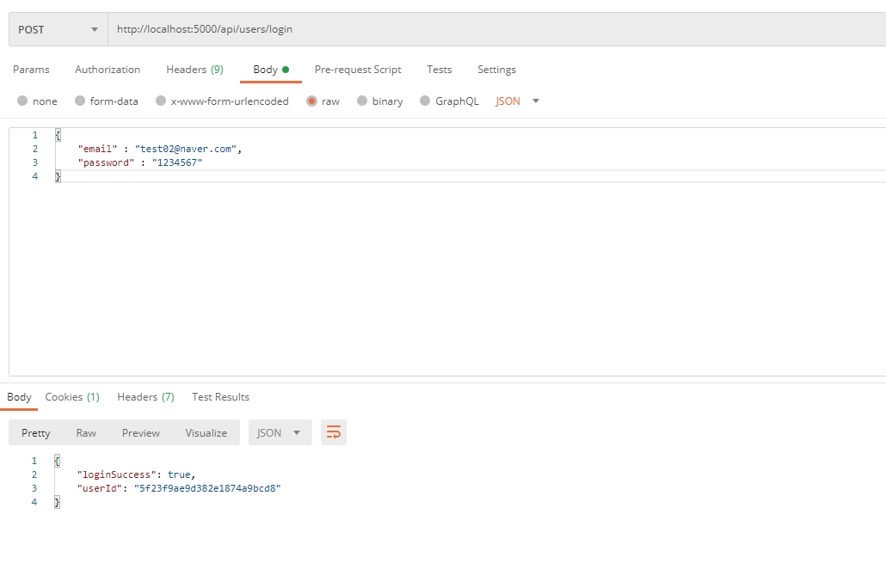

# 11장 & 12장

#### 용어
- jsonwebtoken(JWT)
    - 클레임(Claim) 기반 토큰 방식
    - JSON을 이용한 토큰이며 웹 표준 구현
    - 일반 토큰의 단점을 어느정도 극복 
        - 발급된 토큰에 대하여 만료를 시킬 수단이 없음
        - 발급된 토큰을 검사하거나 처리할 때마다 DB에 접근하여 검사할 경우 부담이 생김
        - 사용자 로그아웃 등으로 인한 토큰을 관리할 수 있는 방법이 없음

```sh
npm install jsonwebtoken --save 
```
- jsonwebtoken 설치 
- https://www.npmjs.com/package/jsonwebtoken 참조하여 사용

- cookie-parser
    - 요청된 쿠키를 쉽게 추출할 수 있도록 해주는 미들웨어(middleware)
    - req.cookie()를 분석(parse)하고 res.cookie()를 javascript object 형태로 저장
    - res.cookie()로 쿠키 생성 

```sh
npm install cookie-parser --save 
```
- cookie-parser 설치 

#### 내용

```sh
app.post('/api/users/login', (req, res) => {
  // 요청된 이메일을 데이터베이스에 있는지 찾음 

  // 조건에 맞는 데이터를 찾는 mongoDB 메소드 
  User.findOne({ email: req.body.email }, (err, user) => {
    // DB에 정보가 없을 경우 
    if(!user) {
      return res.json({
        loginSuccess: false, 
        message: "없는 이메일입니다."
      })
    }

    // 요청된 이메일이 데이터베이스에 있다면 비밀번호가 일치하는지 확인 
    // comparePassword() 메소드 : User 모델에 정의한 비밀번호 비교 메소드 
    // req.body.password : 클라이언트에서 입력한 plain text의 비밀번호
    // isMatch : 클라이언트에서 입력한 비밀번호와 mongoDB에 저장된 비밀번호가 일치하는지에 대한 여부(T/F)
    user.comparePassword( req.body.password, (err, isMatch) => {
      // isMatch = false일 경우 동작, 비밀번호가 일치하지 않을 경우
      if(!isMatch) {
        return res.json({
          loginSuccess: false,
          message: "비밀번호가 일치하지 않습니다."
        });
      }

      // 비밀번호가 일치한다면 토큰 생성
      // gnenerateToken : User 모델에 정의한 토큰 생성 메소드 
      user.generateToken((err, user) => {
        // 오류 발생 시 상태코드 400과 에러메세지를 클라이언트로 전송
        if(err) {
          return res.status(400).send(err);
        }

        // 토큰을 쿠키에 저장, cookie-parser 이용 
        // x_auth : cookie() 메소드의 첫 번째 인자, 쿠키의 이름을 지정
        // user_token : cookie() 메소드의 두 번째 인자, x_auth 쿠키에 저장할 데이터
        res.cookie("x_auth", user.token)
           .status(200)
           .json({
             loginSuccess: true,
             userId: user._id
           })
      })
    })
  }) 
})
```
- 로그인 라우터 

```sh
User.findOne({ email: req.body.email }, (err, user) => {
    ...
}
```
- mongoDB 메소드 
- 요청에 포함된 email을 찾음 

```sh
user.comparePassword( req.body.password, (err, isMatch) => {
      if(!isMatch) {
        return res.json({
          loginSuccess: false,
          message: "비밀번호가 일치하지 않습니다."
        });
      }

      user.generateToken((err, user) => {
        if(err) {
          return res.status(400).send(err);
        }

        res.cookie("x_auth", user.token)
           .status(200)
           .json({
             loginSuccess: true,
             userId: user._id
           })
      })
    })
```
- User.js model에 정의한 comparePassword
- 사용자가 입력한 비밀번호와 mongoDB에 저장된 비밀번호를 비교 

```sh
// 사용자가 입력한 비밀번호와 mongoDB에 저장된 비밀번호를 비교하는 메소드 
// plainPassword : 클라이언트에서 입력한 비밀번호 
// cb : callback function 약어 
userSchema.methods.comparePassword = function(plainPassword, cb) {
    // mongoDB에 저장된 암호화된 비밀번호를 복호화할 수 없기 때문에 
    // plainPassword를 암호화한 뒤 이를 mongoDB에 저장된 암호화된 비밀번호와 비교 
    bcrypt.compare(plainPassword, this.password, function(err, isMatch) {
        // 오류 발생 시 오류 내용을 callback function의 매개변수로 반환 
        if(err) {
            return cb(err);
        }
        // err : null, 오류가 발생하지 않음 
        // isMatch : 비밀번호 일치여부(true) 
        cb(null, isMatch);
    })
}
```
- comparePassword 메소드 
- bcrypt를 이용하여 사용자가 입력한 비밀번호를 암호화한 뒤 이를 mongoDB의 암호화된 비밀번호와 비교 

```sh
// 로그인한 사용자의 토큰을 생성하는 메소드 
userSchema.methods.generateToken = function(cb) {
    // 사용자가 입력한 값을 model을 이용해 가져옴 
    var user = this; 
 
    // jsonwebtoken을 이용해서 token을 생성 
    // user._id와 secretToken을 활용하여 토큰 생성
    // jwt.sign()의 첫 번째 인자는 plain Object여야하므로 toHexString()으로 변환 
    // secretToken을 활용하면 user._id를 추출할 수 있으므로 회원식별가능 
    var token = jwt.sign(user._id.toHexString(), 'secretToken');

    user.token = token;

    // 생성한 토큰을 해당 회원의 레코드에 저장 
    user.save(function(err, user) {
        if(err) {
            return cb(err);
        }
        cb(null, user);
    })
}
```
- generateToken 메소드 
- jsonwebtoken을 이용하여 쿠키에 토큰을 저장 


- mongoDB에 암호화된 비밀번호가 저장된 test02@naver.com 로그인 성공 시 request/response
