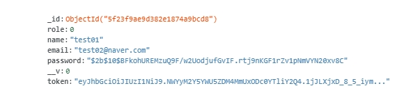
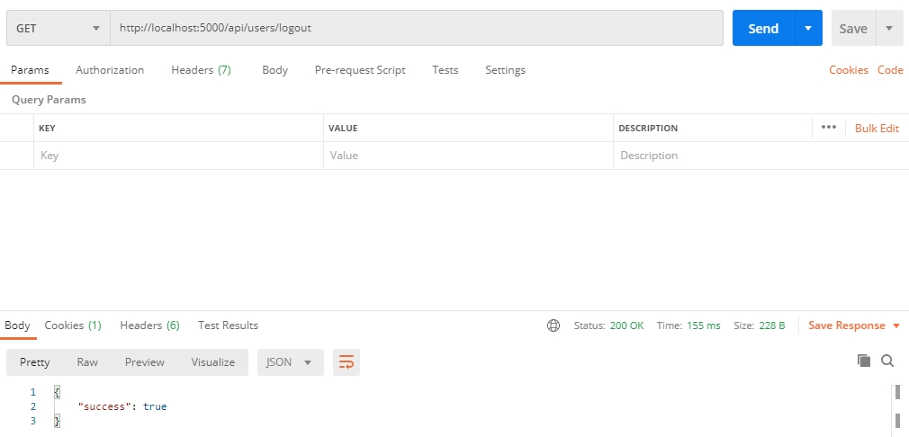
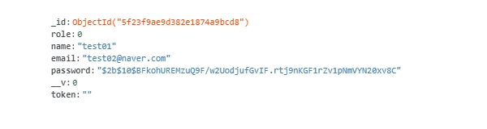

# 14장

#### 내용

```sh
// 로그아웃 기능은 로그인한 유저만이 사용할 수 있으므로 auth middleware 사용 
app.get('/api/users/logout', auth, (req, res) => {
  
  User.findOneAndUpdate({
    // find 조건 
    _id: req.user._id, 
  },
  {
    // update 내용
    token: ""
  }, (err, user) => {
    if(err) {
      return res.json({
          success: false, 
          err
      });
    }

    return res.status(200).send({
      success: true
    });
  })
})
```
- 로그아웃 라우터 
- 인증 라우터에 의해 서비스를 로그인한 유저, 즉 mongoDB에 토큰이 존재하는 유저만이 사용할 수 있으므로 mongoDB에 유저 레코드의 토큰을 제거하면 로그아웃 처리됨 


- 로그인 상태의 유저 
- mongoDB 유저 레코드에 token이 존재 


- 로그아웃 성공 시 request/response
- 

- mongoDB token 컬럼 null String으로 갱신(로그아웃)