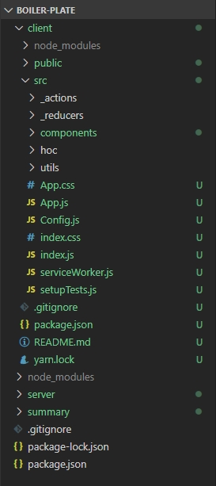

# 19장

#### 내용 

###### boiler-plate 구조 

- src/_actions : Redux를 위한 폴더
- src/_reducers : Redux를 위한 폴더
- src/components/views : page(Landing/Login/NavBar/Register/Footer)이 위치한 폴더 
- src/App.js : Routing 관련 작업 처리 
- src/Config.js : 환경 변수 정의 
- src/hoc : Higher Order Component를 모아놓는 폴더
- src/utils : 재사용이 가능한 컴포넌트들을 모아놓는 폴더 