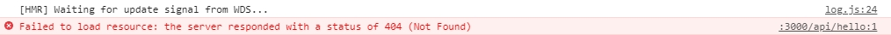
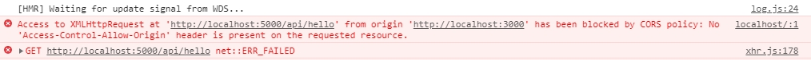

# 21장
#### 용어
- Axios
    - HTTP 클라이언트 라이브러리로 비동기 방시긍로 HTTP 데이터 요청을 실행 
    - 직접적으로 XMLHttpRequest를 다루지 않고 AJAX 호출이 가능
    - promise를 기반으로 하여 async/await 문법을 사용하여 XHR 요청을 간편하게 할 수 있음

- useEffect 
    - react의 가장 기본적인 hook으로 함수형 컴포넌트에서도 가변적인 상태를 지니고 있을 수 있게 해주는 기능

#### 내용 

```sh
function LandingPage() {
    useEffect(() => {
        axios.get('/api/hello')
             .then(response => console.log(response.data));
    }, []);

    return (
        <div>
            LandingPage
        </div>
    )
}
```
- /api/hello로 axios get 요청 시 http://localhost:3000/api/hello로 요청됨


- http://localhost:3000/api/hello로 요청되어 404 오류 발생

```sh
function LandingPage() {
    useEffect(() => {
        axios.get('http://localhost:5000/api/hello')
             .then(response => console.log(response.data));
    }, []);

    return (
        <div>
            LandingPage
        </div>
    )
}
```
- http://localhost:5000/api/hello로 axios get 요청 시 CORS 정책으로 인해 오류 발생 


- CORS 정책으로 인해 오류 발생