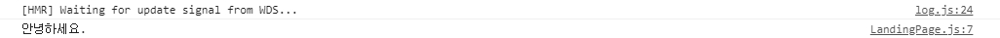

# 22장
#### 용어
- CORS(Cross-Origin Resource Sharing)
    - 다른 도메인에서 실행중인 웹 애플리케이션에서 선택한 자원에 대한 접근 권한을 부여하는 매커니즘
    - 기본값은 다른 도메인과의 통신을 허용하지 않음

- http-proxy-middleware
    - 리액트에서 백엔드 서버(node.js)로 API 요청 시 발생할 수 있는 CORS 관련 오류를 방지하기 위해 proxy를 설정하기 위한 모듈

```sh
npm install http-proxy-middleware --save 
```

#### 내용 

```sh
const { createProxyMiddleware } = require('http-proxy-middleware');

module.exports = function(app) {
  app.use(
    '/api',
    createProxyMiddleware({
      // node.js의 서버 포트는 5000이므로 아래와 같이 명시 
      target: 'http://localhost:5000',
      changeOrigin: true,
    })
  );
};
```
- src/setupProxy.js
- https://create-react-app.dev/docs/proxying-api-requests-in-development/ 참조 


- CORS 오류가 해결되어 정상적으로 콘솔에 출력됨 