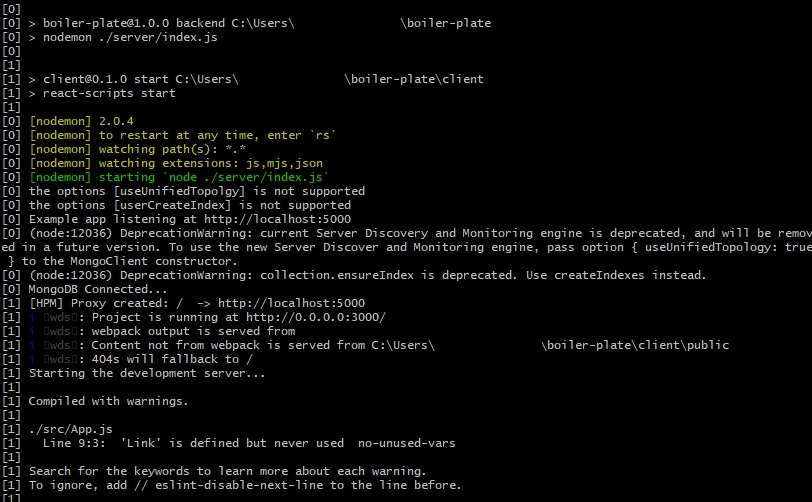

# 24장
#### 용어
- Concurrently
    - 서버와 클라이언트를 동시에 실행시키기 위한 모듈

```sh
npm install concurrently --save
```

#### 내용

```sh
 "scripts": {
   "start": "node ./server/index.js",
    "backend": "nodemon ./server/index.js",
    "test": "echo \"Error: no test specified\" && exit 1",
    "dev": "concurrently \"npm run backend\" \"npm run start --prefix client\""
  }
```
- https://www.npmjs.com/package/concurrently 참조 
- client와 server 두 개의 폴더 디렉토리를 가지고 있기 때문에 이를 dev라는 명령어로 한 번에 실행 


- Concurrently를 통해 서버와 클라이언트를 동시에 실행했을 때의 터미널 