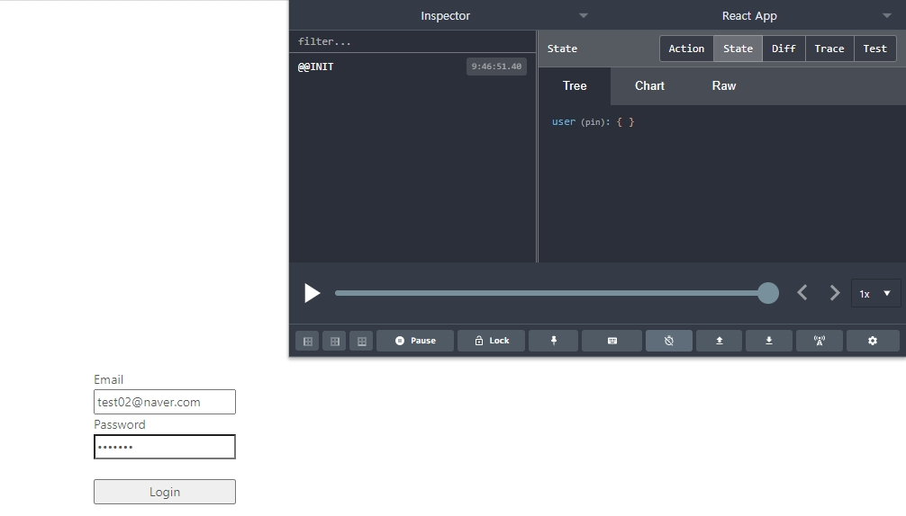
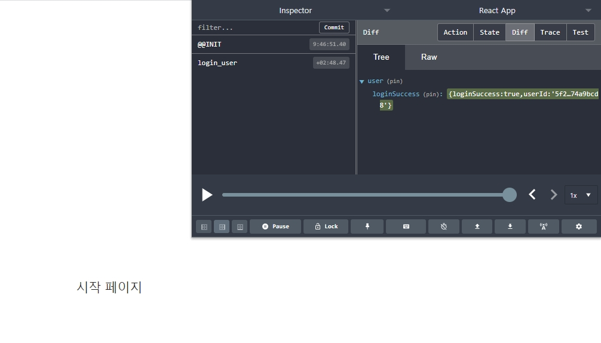

# 29장 & 30장
#### 내용
```sh
// action이 반환하는 type만을 관리하는 js

export const LOGIN_USER = 'login_user';
export const REGISTER_USER = 'register_user';
export const AUTH_USER = 'auth_user';
```
- /client/src/_actions/types.js

```sh
import Axios from 'axios';

// reducer로 반환할 type을 types.js에서 가져옴 
import {
    LOGIN_USER
} from './types';

// axios를 통해 server와 통신하는 역할을 담당하는 action 
// dataToSubmit : body를 통해 전달한 email, password 
export function loginUser(dataTosubmit) {


    // 서버의 로그인 라우터의 반환값(response.data)를 request에 저장 
    const request = Axios.post('/api/users/login', dataTosubmit)
                         .then(response => response.data)

    // action에서 다룬 데이터를 Reducer로 반환(전달)                 
    return {
        type : LOGIN_USER,
        payload : request
    }
}
```
- /client/src/_actions/user_action.js

```sh
// reducer로 반환할 type을 types.js에서 가져옴 

import {
    LOGIN_USER
} from '../_actions/types';

// state : 이전 state 
// action : state를 처리하는 action 
export default function(state = {}, action) {
    // 각 라우터에 따른 다양한 type이 오기 때문에 switch문으로 처리
    // action에서 데이터를 조작한 뒤 return으로 어떠한 기능을 수행했는지 명시하는 type과 수행 결과인 request를 reducer에 return하므로 action.type로 접근 
    switch (action.type) {
        case LOGIN_USER :
            // ...state : predleOperator로 이전 state를 그대로 가져옴 
            // 이전 state는 빈( {} ) 상태
            // action.playload = 서버(node.js)의 로그인 라우터에서 반환한 response { loginSuccess: true, userId: user._id }를 loginSuccess에 저장 
            return { ...state, loginSuccess : action.payload }
            break;
        default:
            return state;
    }
}
```
- /client/src/_reducer/user_reducer.js

```sh
// react에서 state 관리를 위해 useState를 가져옴 
import React, { useState } from 'react';

// redux를 사용하기 위해 useDispatch를 가져옴 
import { useDispatch } from 'react-redux';

// loginUser reducer를 가져옴 
import { loginUser } from '../../../_actions/user_action';

function LoginPage(props) {
    // redux의 action을 생성하기 위해 dispatch를 생성 
    const dispatch = useDispatch();

    // email 정보를 관리하기 위한 email 전용 state
    // 초기값은 null string  
    const [Email, setEmail] = useState("");

    // password 정보를 관리하기 위한 password 전용 state 
    // 초기값은 null string 
    const [Password, setPassword] = useState("");

    // onChange를 통해 email state를 변경하도록 하는 function 
    const onEmailHandler = (event) => {
        // email onChange event가 binding된 input의 값을 추출해 email state에 대입 
        setEmail(event.currentTarget.value);
    }

    // onChange를 통해 password state를 변경하도록 하는 function 
    const onPasswordHandler = (event) => {
         // password onChange event가 binding된 input의 값을 추출해 password state에 대입 
        setPassword(event.currentTarget.value);
    }

    // input에 입력한 email과 password 
    const onSubmitHandler = (event) => {
        // event의 확산(진행)을 정지시킴
        // form의 경우 onSubmit() event를 통해 submit을 실행하면 이벤트 완료 후 곧장 refresh가 되기 때문에 
        // react와 같은 SPA에서는 원하는 이벤트를 처리할 수 없기 때문에 event의 진행을 정지시킴
        event.preventDefault();

        // server에 input에 입력한 email과 password를 전달하기 위한 객체 body 명시 생성 
        let body = {
            email : Email, 
            password : Password
        };

        // loginUser라는 action을 통해 reducer에 데이터를 전달하고자 함 
        dispatch(loginUser(body))
            .then(response => {
                if(response.payload.loginSuccess) {
                    // 로그인 성공 시 페이지 이동
                    props.history.push('/');
                }
                // 로그인 실패 시 
                else {
                    alert('Error');
                }
            });
    }

    return (
        <div style={{
            display: 'flex', justifyContent: 'center', alignItems: 'center'
            , width: '100%', height: '100vh'
        }}>
            <form style={{ display: 'flex', flexDirection: 'column' }}
                  onSubmit={onSubmitHandler}
            >
                <label>Email</label>
                <input type='email' value={Email} onChange={onEmailHandler} />
                <label>Password</label>
                <input type='password' value={Password} onChange={onPasswordHandler} />

                <br />
                <button type='submit'>
                    Login
                </button>
            </form>
        </div>
    )
}

export default LoginPage;
```
- /client/src/components/LoginPage/LoginPage.js


- 로그인 전 state 


- 로그인 후 state 
- LandingPage로 이동