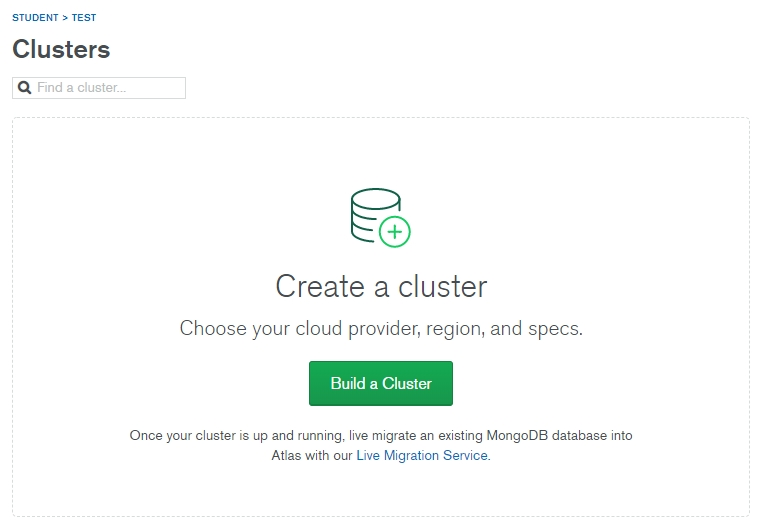
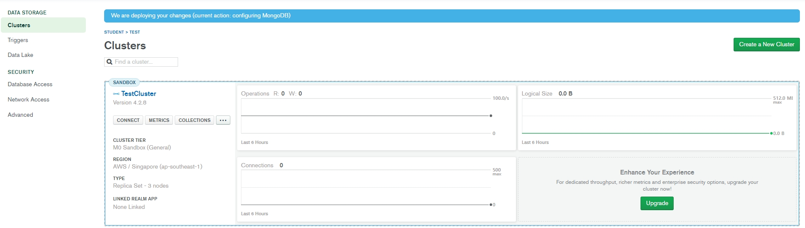

# 3장

#### 용어
- ORM(Object Document Mapping)
    - 데이터를 DB에서 조회할 때 자바스크립트 객체로 변환해주는 역할

- mongoose
    - mongoDB의 ODM 중 하나 

#### 내용

- mongodb.com 계정 생성 후 Projects -> New Project 

- Project 이름 설정

- 공유할 계정 설정 
- 없으므로 Create Project로 프로젝트 생성 

- Clusters -> 새로운 클러스터 생성 

- 무료인 Shared Clusters 선택 

- Provider: aws, Region: Singapore 선택

- Free Tier인 M0 Sandbox 선택 

- 클러스터 이름 설정

- 클러스터 생성 직후 1~3분 정도 기다려야함 

- 좌측의 Network Access 클릭

- ADD IP Address로 해당 클러스터에 접근할 수 있는 IP 설정

- 좌측 중단의 ADD CURRENT IP ADDERSS로 현재 내 IP 선택
- 추후 상황에 따라 추가로 접근 가능한 IP 설정 가능

- ADD IP Address 완료 후 Network Access에서 설정한 IP에 대한 상태를 확인할 수 있음 

- 데이터베이스 유저 생성 
- 해당 클러스터로 접근할 때 사용

- 데이터베이스 유저 생성 후 Chooose a connection method 선택

- Connect your application 선택

- 애플리케이션의 설정을 선택하고 해당 클러스터로 접근할 수 있는 문자열 복사 
- mongoose로 연결