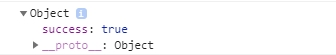

# 32장
#### 내용
```sh
function LandingPage(props) {
    /*
    useEffect(() => {
        axios.get('/api/hello')
             .then(response => console.log(response.data));
    }, []);
    */

    // logout handler 
    const onClickHandler = () => {
        // 추가적인 작업이 필요하지 않으므로 곧장 axios를 통해 get방식으로 server에 로그아웃 요청 
        axios.get('/api/users/logout')
             .then(response => {
                 // 로그아웃 성공 시 LoginPage로 이동
                 if(response.data.success) {
                     props.history.push("/login");
                 }
                 // 로그아웃 실패 시 경고창 출력 
                 else {
                     alert('로그아웃에 실패했습니다.')
                 }
                 console.log(response.data);
             })
    }

    return (
        <div style={{
            display: 'flex', justifyContent: 'center', alignItems: 'center'
            , width: '100%', height: '100vh'
        }}>
            <h2>시작 페이지</h2>

            <br/>

            <button onClick={onClickHandler} >
                로그아웃
            </button>
        </div>
    )
}
```
- /client/src/components/views/LadingPage/LandingPage.js


- 로그아웃 시 response data 