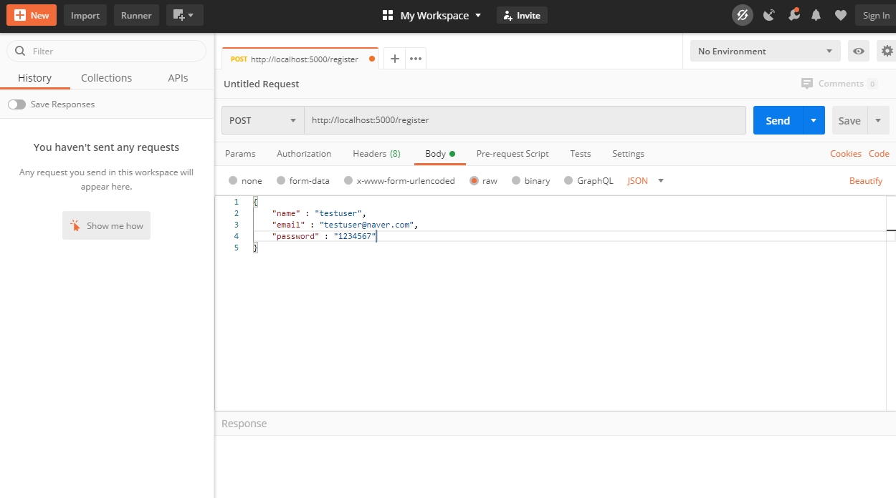
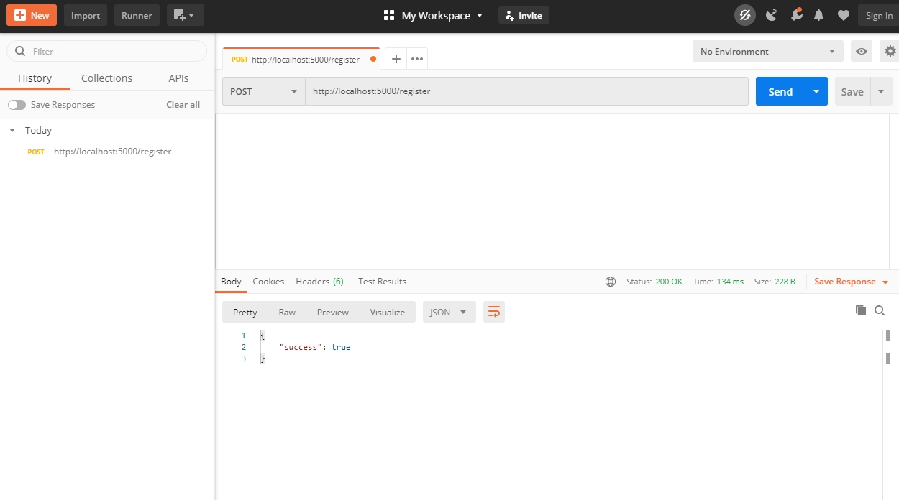
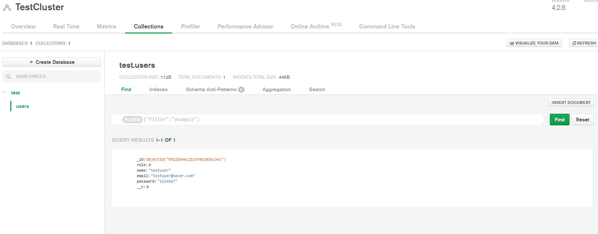

# 7장

#### 용어
- body-parser
    - body 데이터를 분석(parse)하여 출력하는 용도
    - POST request data의 body로부터 parameter를 편리하게 추출해주는 기능을 제공하는 module

```sh
$ npm install body-parser --save
```
- body-parser 설치 

- Postman 
    - 개발한 API를 테스트하고 테스트 결과를 공유하여 API 개발의 생산성을 높여주는 플랫폼
    - 현재 프로젝트에서는 server만 준비되고 client는 준비되지 않았기 때문에 client 없이 데이터를 server에 전송하기 위해 사용 

#### 내용

```sh
app.use(bodyParser.urlencoded({extended: true}));
```
- application/x-www-form-urlencoded 인코딩

```sh
app.use(bodyParser.json());
```
- application/json 인코딩

```sh
app.post('/register', (req, res) => {
  // 회원 가입시 필요한 정보들을 client에서 받아 데이터베이스에 저장하는 라우터

  // body-parser 설정으로 request의 body를 인코딩해서 사용할 수 있음 
  const user = new User(req.body)

  // mongodb에 저장 
  user.save((err, doc) => {
    // 에러 발생시 
    if(err) {
      // response에 json 형태로 success 여부(false)와 에러 전송
      return res.json({ success: false, err })
    }
    // 성공시 json 형태로 success 여부(true) 전송 
    return res.status(200).json({ success: true })
  });
});
```
- 회원가입을 위한 API 

```sh
    app.listen(port, () => console.log(`Example app listening at http://localhost:${port}`));
```
- 화살표 함수 사용 

```sh
app.listen(port, function() {
  console.log(`Example app listening at http://localhost:${port}`)
});
```
- 위의 화살표 함수와 동일한 기능


- Postman으로 json 데이터 전송 


- 전송 성공
- return res.status(200).json({ success: true }) 에 의한 반환 


- 클러스터에 정상적으로 저장됨 