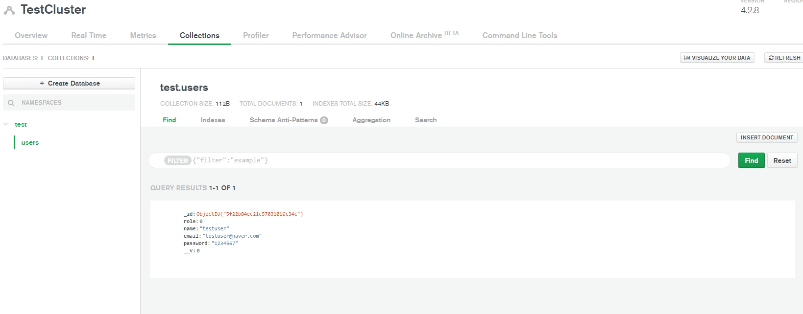

# 8장

#### 용어
- nodemon
    - 파일의 변경을 감지하여 서버를 자동으로 다시 시작하는 Tool

```sh
$ npm install nodemon --save-dev 
```
- nodemon 개발 모드로 설치 

- -dev
    - 개발모드와 배포모드 중 개발모드, local에서만 사용하겠다는 명령어

```sh
  "dependencies": {
    "body-parser": "^1.19.0",
    "express": "^4.17.1",
    "mongoose": "^5.9.26"
  },
  "devDependencies": {
    "nodemon": "^2.0.4"
  }
```
- nodemon은 일반 dependencies가 아닌 개발모드의 devDependencies에서 관리됨 

#### 내용

```sh
  "scripts": {
    "start": "node index.js",
    "backend" : "nodemon index.js", 
    "test": "echo \"Error: no test specified\" && exit 1"
  }
```
- nodemon 실행을 위해 scripts에 명령어 추가 


- nodemon으로 실행했을 때의 터미널 


- 서버 실행 도중 코드를 변경했을때의 터미널


- 클러스터에 정상적으로 저장됨 
